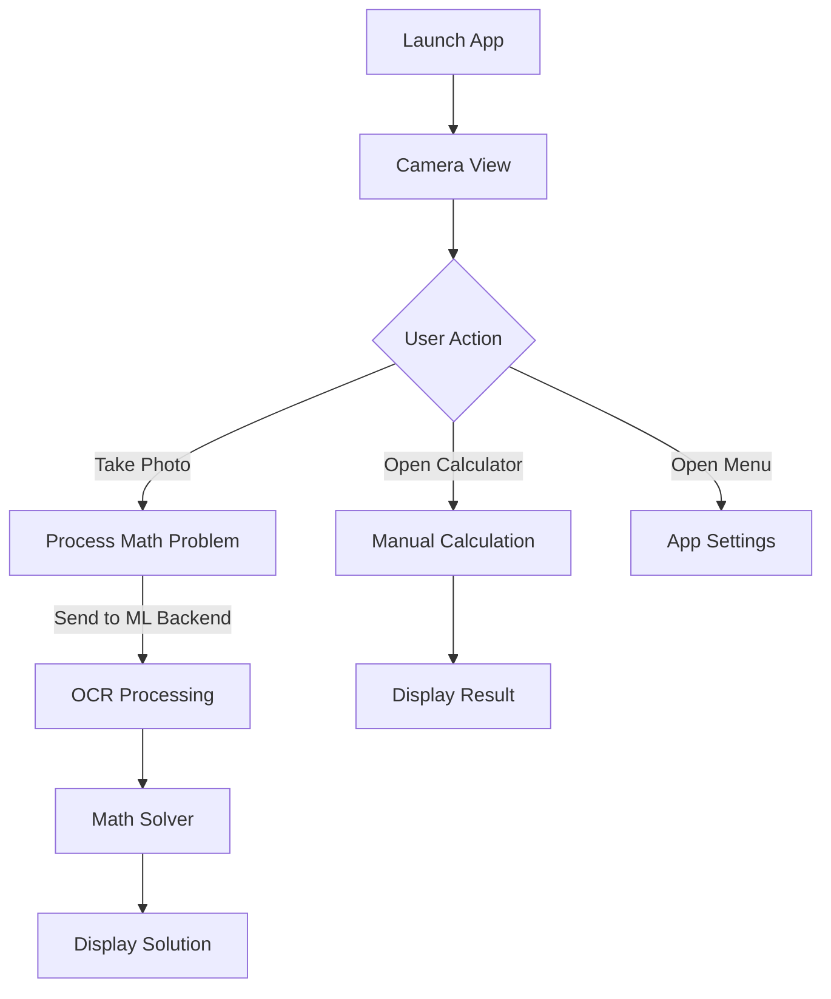

# MathCam

## 📱 Overview

MathCam is a powerful iOS application that allows users to solve mathematical problems by simply taking a photo. Built with SwiftUI and integrated with machine learning models, this app brings the convenience of optical character recognition (OCR) to mathematics, making problem-solving faster and more intuitive.

---

## ✨ Features

### 📸 Camera Integration
- Real-time camera preview with frame guides
- Photo capture functionality for math problems
- Machine learning powered image processing for accurate text recognition

### 🧠 ML-Based Math Solver
- Advanced OCR for equation detection
- Intelligent equation parsing and solving
- Support for a wide range of mathematical notations

### 🧮 Built-in Calculator
- Comprehensive mathematical operations
- Support for basic arithmetic: +, -, ×, ÷
- Advanced functions: trigonometry, logarithms, calculus symbols
- User-friendly interface with intuitive controls

### 📋 Menu System
- Language selection (currently English)
- Settings configuration
- Help center access
- About information
- Premium features (MathCam Plus)

---

## 🛠️ Technical Architecture

### Core Components
- **Frontend (iOS)**
  - SwiftUI: Modern declarative UI framework
  - AVFoundation: Camera and photo capture capabilities
  - Combine: For reactive programming and API integration
  
- **Backend**
  - FastAPI: High-performance Python web framework
  - TensorFlow: Machine learning framework for OCR and equation solving
  - SymPy: Symbolic mathematics library

For more details on the architecture, see [ARCHITECTURE.md](docs/ARCHITECTURE.md).

---

## 🔄 Workflow

---

## 🚀 Getting Started

### Prerequisites
- **Frontend**
  - iOS 18.4+
  - Xcode 16.3+
  - Swift 5.9+
  - iPhone with camera access

- **Backend**
  - Python 3.8+
  - Required packages listed in `backend/requirements.txt`

### Installation

#### Frontend
1. Open `frontend/MathCam/MathCam.xcodeproj` in Xcode
2. Build and run on your device

#### Backend
1. Navigate to the backend directory: `cd backend`
2. Install required packages: `pip install -r requirements.txt`
3. Start the API server: `python -m api.main`

---

## 🔮 Future Enhancements

- [ ] Handwriting recognition
- [ ] Step-by-step solution explanations
- [ ] Problem history and favorites
- [ ] Cloud synchronization
- [ ] Multi-language support
- [ ] Dark mode support
- [ ] Offline capability

---

## 📄 License

This project is licensed under the MIT License - see the LICENSE file for details.

---

## 👨‍💻 Author

Cyprien OUDART

---

*"Making mathematics accessible through technology"* 